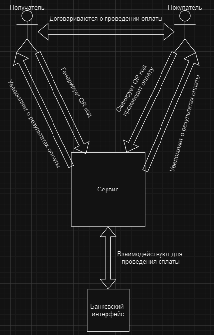
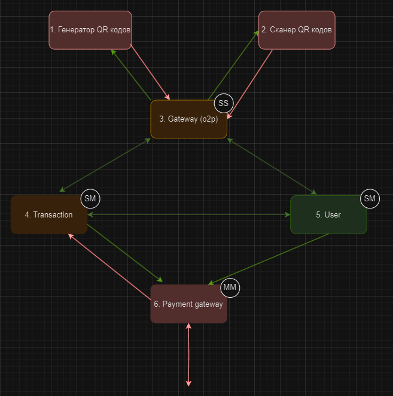
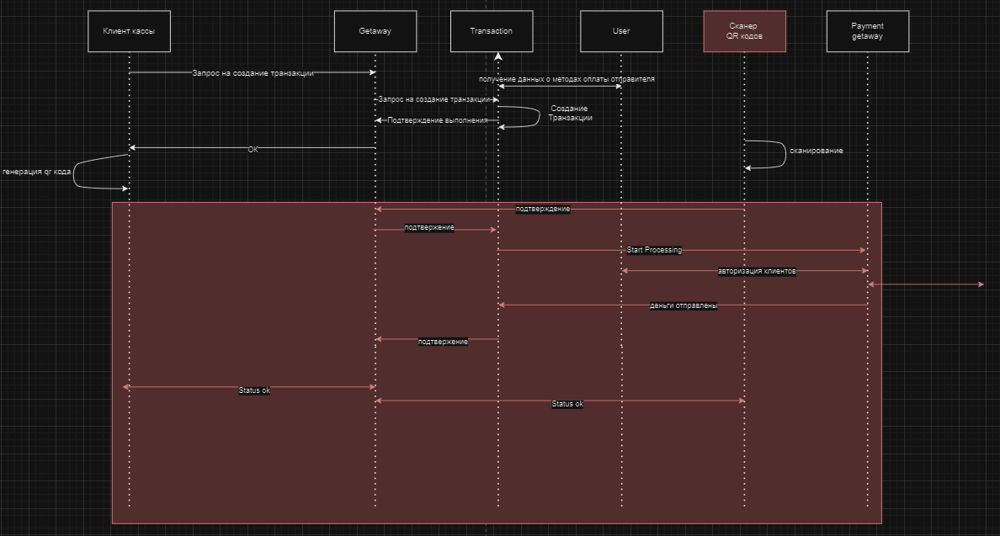
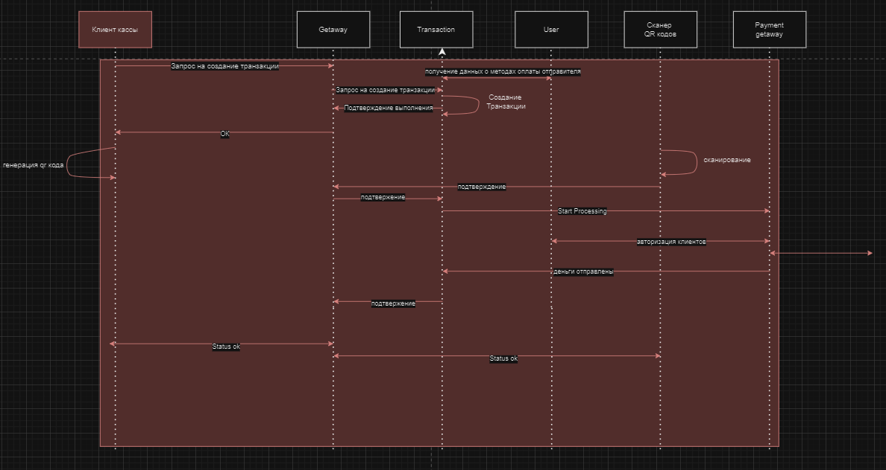
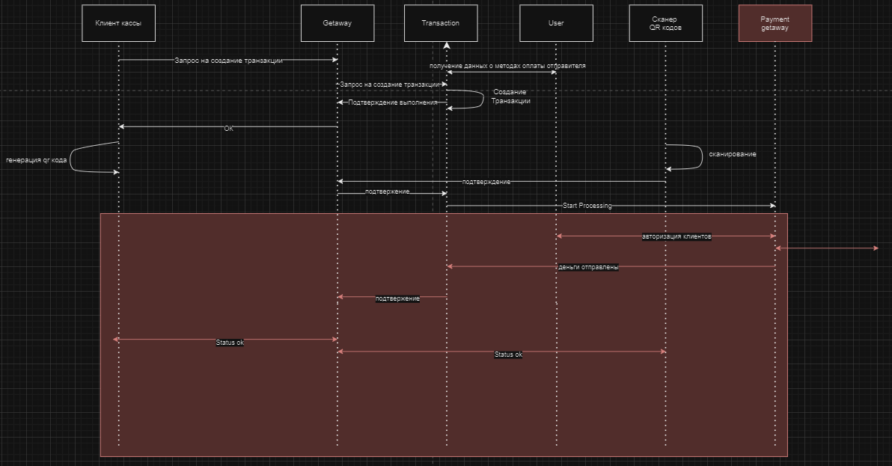

# QR code payment system

## Краткое описание

Backend система оплаты через QR коды. Программное обеспечение, которое позволяет клиенту проводить оплату по средством сканирования QR кода.

Основными задачами такой системы будут являться предоставление пользователю разных вариантов оплаты (разные банки, криптовалюты и т.д.), обеспечение безопасности пользовательских данных, обеспечение производительности.

## Цели и предположения безопасности

**Цели безопасности:**

1. При любых обстоятельствах состояние транзакций и уведомление пользователей о её результате аутентично.

2. При любых обстоятельствах только авторизованный пользователь имеет доступ к своей конфиденциальной информации.

3. При любых обстоятельствах проводятся только аутентичные и авторизованные операции.

**Предположения безопасности:**

1. Аутентичное средство оплаты благонадёжно и выполняет возлагаемую на него логику.

2. Продавец и покупатель договорились о проведении операции.

3. Аутентичное средство оплаты благонадёжно и выполняет возлагаемую на него логику.

## Базовый вариант

Как продавец, так и покупатель взаимодействуют с сервисом по определённым сценариям, также сервис интегрируется к интерфейсам банков для проведения оплаты

## Архитектура системы

**Компоненты:**

+ *Генератор QR кодов* - генерирует QR коды для продавца в соответствии с передаваемой информацией (фронтенд, который мы не реализовываем, но в схеме он необходим)

+ *Сканер QR кодов* - Получает QR код, достаёт нужную информацию оттуда (фронтенд, который мы не реализовываем, но в схеме он необходим)

+ *Transaction* - сервис, который хранит и работает с транзакциями

+ *User* - сервис, который обрабатывает и хранит пользовательскую информацию

+ *Payment getaway* - сервис, работающий с клиентами платежных систем

## Базовый и негативные сценарии

**Базовый сценарий:**

**Негативный сценарий 1:**

Компрометация клиента, отправляющего деньги –  *ЦБ 1 2 3 нарушены*

**Негативный сценарий 2:**

Компрометация клиента, запрашивающего транзакцию – *ЦБ 1 2 3 нарушены*

**Негативный сценарий 3:**

Компрометация getaway – *ЦБ 1 и 3 нарушены*

