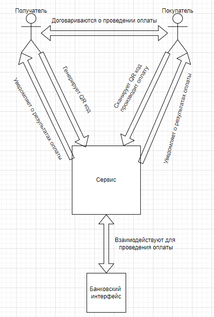
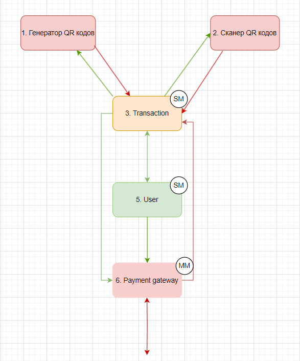
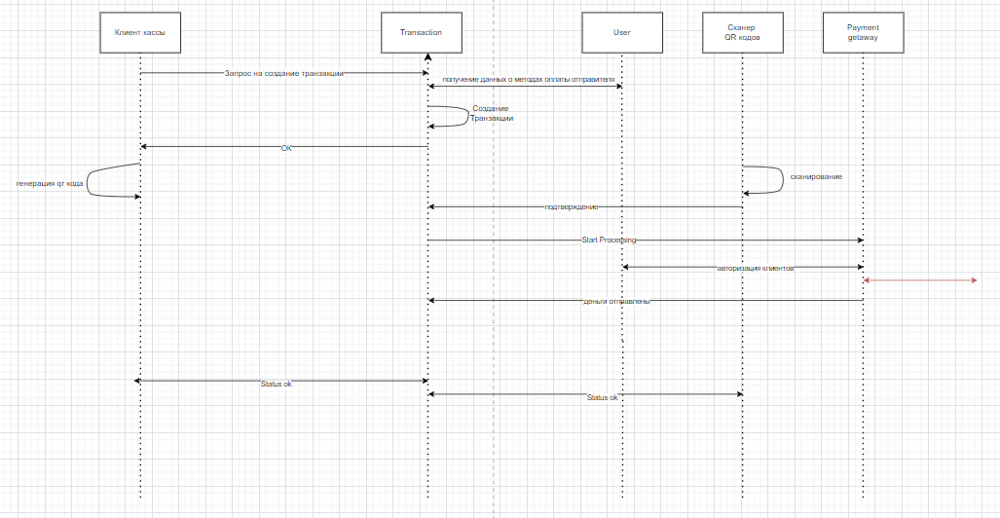
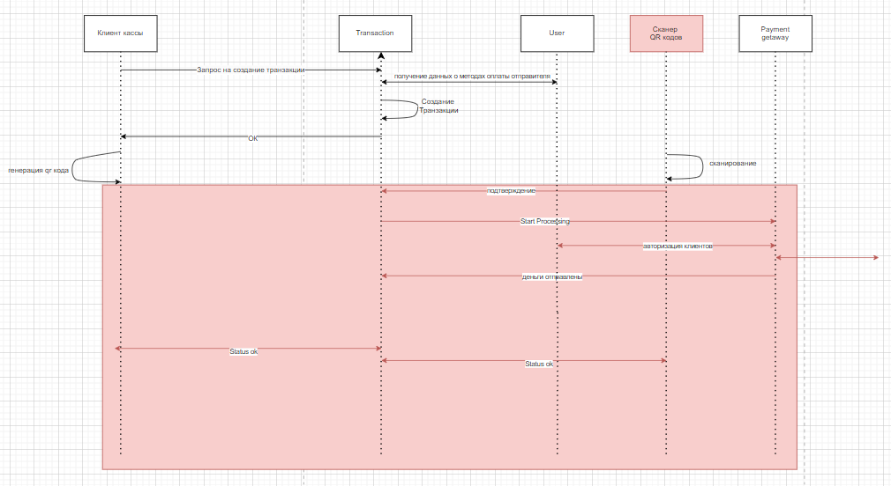
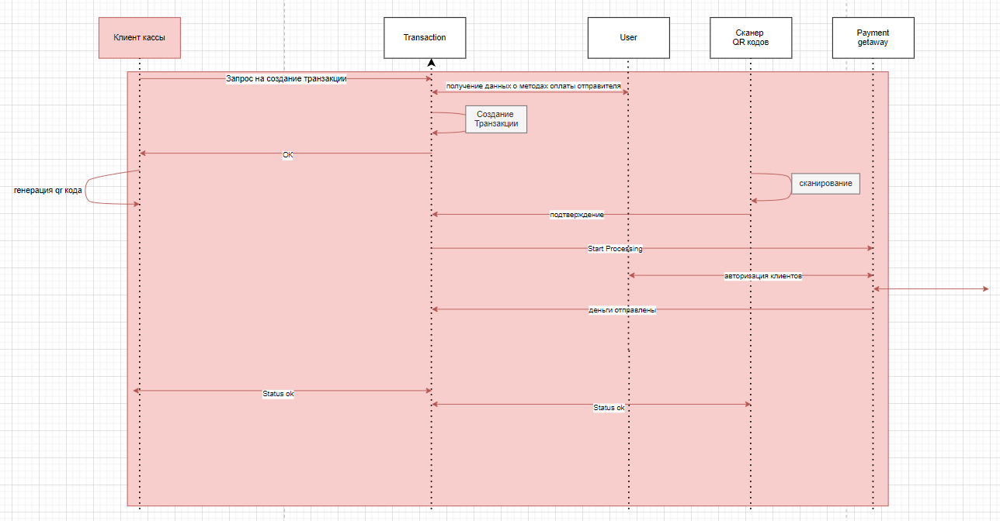
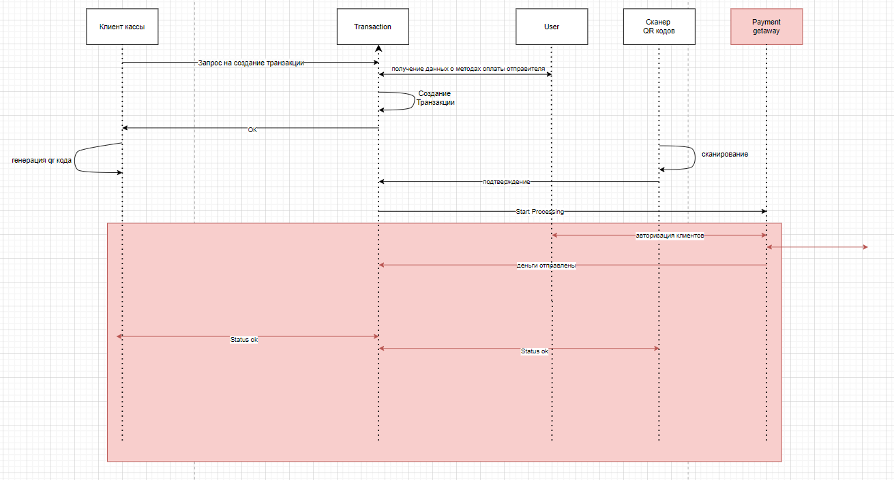

# QR code payment system

## Краткое описание

Backend система оплаты через QR коды. Программное обеспечение, которое позволяет клиенту проводить оплату по средством сканирования QR кода.

Основными задачами такой системы будут являться предоставление пользователю разных вариантов оплаты (разные банки, криптовалюты и т.д.), обеспечение безопасности пользовательских данных, обеспечение производительности.

## Цели и предположения безопасности

**Цели безопасности:**

1. При любых обстоятельствах только авторизованный пользователь имеет доступ к своей конфиденциальной информации.

2. При любых обстоятельствах проводятся только аутентичные и авторизованные операции.

**Предположения безопасности:**

1. Аутентичное средство оплаты благонадёжно и выполняет возлагаемую на него логику.

2. Продавец и покупатель договорились о проведении операции.

## Базовый вариант

Как продавец, так и покупатель взаимодействуют с сервисом по определённым сценариям, также сервис интегрируется к интерфейсам банков для проведения оплаты

## Архитектура системы

**Компоненты:**

+ *Генератор QR кодов* - генерирует QR коды для продавца в соответствии с передаваемой информацией (фронтенд, который мы не реализовываем, но в схеме он необходим)

+ *Сканер QR кодов* - Получает QR код, достаёт нужную информацию оттуда (фронтенд, который мы не реализовываем, но в схеме он необходим)

+ *Transaction* - сервис, который хранит и работает с транзакциями. Дополнительно проверяет корректность статуса транзакции после Payment getaway

+ *User* - сервис, который обрабатывает и хранит пользовательскую информацию

+ *Payment gateway* - сервис, работающий с клиентами платежных систем. Получает приватные данные в зашифрованном виде и затем дешифрует, такой подход необходим для сохранения конфиденциальности пользователей

## Базовый и негативные сценарии

**Базовый сценарий:**

**Негативный сценарий 1:**

Компрометация клиента, отправляющего деньги –  *ЦБ 1 2 3 нарушены*

**Негативный сценарий 2:**

Компрометация клиента, запрашивающего транзакцию – *ЦБ 1 2 3 нарушены*

**Негативный сценарий 3:**

Компрометация getaway – *ЦБ 1 и 3 нарушены*

## Сценарии E2E тестов

**Тест 1 - успешный сценарий:**
1. Запускается скрип заполняющий бд информацией о пользователях(сами ничего не создаём)
2.  Авторизируем продавца, получаем токен
3. Создаём транзакцию с аккаунта продавца
4.Проверяем статус транзакции("created")
5. Авторизируем покупателя, получаем токен
6. Принимаем транзакцию за покупателя
7. Проверяем статус транзакции("accept")

**Тест 2 - отмена транзакции:**
1. Запускается скрип заполняющий бд информацией о пользователях(сами ничего не создаём)
2.  Авторизируем продавца, получаем токен
3. Создаём транзакцию с аккаунта продавца
4.Проверяем статус транзакции("created")
5. Отменяем транзакцию
6.Проверяем статус транзакции("cancelled")

## Карта здоровья ИТ-проекта

https://docs.google.com/spreadsheets/d/1NFYdzP-s8rPzLp-JMxeqExbYZbgCdgFmjBpAcQE9rN4/edit?usp=sharing

## Draw io

https://drive.google.com/file/d/1bpc8uGlBVr7oEz4GABSWPcLvyC-9ss_e/view?usp=sharing
